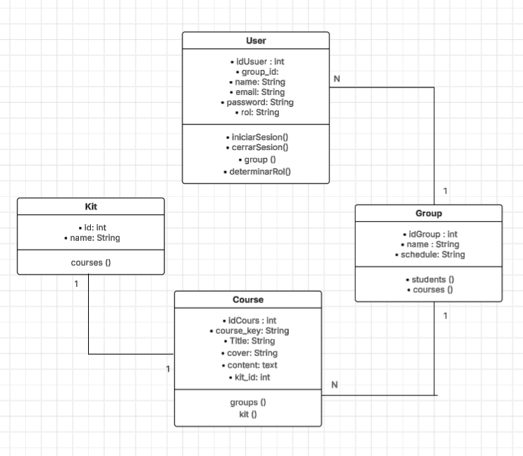

# Tarea 6: Robotics Courses Management System

## Description
Este proyecto es un sistema de backend desarrollado en **Laravel 7** diseñado para gestionar la oferta educativa de una academia de robótica. El sistema permite el control de cursos, la asignación de kits de robótica y la organización de grupos académicos, utilizando el patrón de arquitectura **MVC**.

## ER Diagram
Aquí se presenta la estructura relacional de la base de datos:

## Key Features
* **User Management:** Roles administrativos, docentes y estudiantes.
* **Course Catalog:** Gestión de 100 cursos con integración de kits específicos.
* **Database Seeding:** Poblado automático de datos para pruebas.
